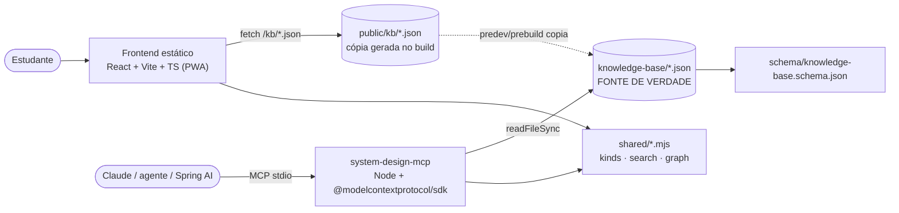

# Architecture — System Design Specialist Lab

Documento da arquitetura **do próprio Lab** (não dos sistemas estudados — esses estão em
`system-design-knowledge-map.md` e nas coleções da base).

> Histórico: até 2026-07 havia um BFF Java/Spring (ADR-0002). Ele foi aposentado; esta página
> descreve o estado atual.

## Visão geral

Uma fonte de verdade (`knowledge-base/*.json`), dois consumidores e **um** código de busca/grafo:

1. **Knowledge base** — um array JSON por coleção, validado por JSON Schema e por testes de
   integridade. Coleções: topics, patterns, flows, interview-questions, diagrams, evidence,
   ai-agents-glossary, databases, **failure-modes, incident-drills, comparisons, learning-paths,
   rubrics** (ADR-0005).
2. **Frontend** — navega e treina: tópicos, padrões, fluxos, diagramas, bancos, Modo Entrevista e
   o grupo **Produção & Falhas** (failure modes, drills, cadeias, quiz, revisão, trilhas, busca).
   100% estático; progresso e revisão espaçada em `localStorage`.
3. **MCP server** (`mcp/`) — expõe a base como tools (`overview`, `search`, `list`, `get`,
   `related`) para agentes, sempre com `sourceRefs`.
4. **`shared/`** — ESM puro, sem dependências, importado pelos dois consumidores (ADR-0006):
   - `kb-kinds.mjs`: registro de coleções (arquivo, descrição, rota) + `titleOf/summaryOf`;
   - `kb-search.mjs`: busca determinística por nome **e por sintoma**;
   - `kb-graph.mjs`: arestas derivadas de todos os campos de relação, `related()` e alcançabilidade
     causal (`canCause`).

**Sem LLM, sem rede e sem banco em runtime.**

## Modelo de conteúdo e relações

- Cada item tem `id` (kebab-case), `sourceRefs` (≥1) e campos específicos da coleção.
- **Relações são guardadas uma vez** e o inverso é derivado pelo grafo. Direções canônicas:
  - `topics/patterns/flows/diagrams/evidence/databases` → os campos `related*`/`diagrams` que já
    existiam;
  - `failure-modes` → `relatedTopics`, `relatedPatterns`, `diagrams`, `canCause` (causal dirigida),
    `confusedWith`, refs dentro de `immediateMitigation`/`longTermSolutions` (vira `mitigatedBy`),
    passos de `failureChain` e `interview.whatIf[].leadsTo`;
  - `interview-questions` → `failureModes`, `relatedQuestions` (além de `patterns/relatedTopics`);
  - `incident-drills` → `failureModes` (o primeiro é o diagnóstico) e `answer.ruledOut`;
  - `comparisons` / `learning-paths` → `KbRef {kind,id}`.
- Tipos de aresta derivados: `relatedTopic`, `relatedPattern`, `diagram`, `canCause`,
  `confusedWith`, `mitigatedBy`, `chainStep`, `whatIfLeadsTo`, `exercisesFailureMode`,
  `relatedQuestion`, `diagnoses`, `ruledOut`, `compares`, `pathStep`, `suggestsDatabase`.

## Qualidade (o que o CI prova)

| Gate | Onde | O que garante |
|------|------|---------------|
| Schema | `frontend/test/kb-schema.test.mjs` | todo arquivo da KB declarado e válido contra o schema; o validador falha se o schema usar palavra-chave não suportada |
| Integridade | `frontend/test/kb-integrity.test.mjs` | fontes válidas, ids únicos, cross-refs legados, padrões obrigatórios |
| Grafo | `frontend/test/kb-graph.test.mjs` | toda aresta resolve, sem self-reference, cadeia de falha coerente com `canCause`, quality gates por failure mode, nenhum failure mode órfão, drills não entregam o diagnóstico, rubrica consistente |
| Busca | `frontend/test/kb-search.test.mjs` | 46 consultas por sintoma, distinção request × mensagem, determinismo, filtros |
| Estudo | `frontend/test/study-logic.test.mjs` | revisão espaçada, quiz determinístico, jogo da cadeia, Mermaid gerado |
| Rotas | `frontend/test/route-coverage.test.mjs` | todo link aponta para rota registrada |
| Build | `npm run build` | `tsc --noEmit` strict + Vite |
| MCP | `mcp: npm run build && npm run smoke` | tools, contagens reais, busca por sintoma com fontes, `get` das coleções novas, `related` com aresta derivada, erros tipados |

## Frontend

- React + Vite + TypeScript strict, `react-router-dom`, `mermaid`, `react-markdown`.
- `src/api.ts`: loaders tipados de `/kb/*.json` (cacheados por arquivo) e `hrefFor(ref)`.
- `src/kbGraph.ts`: constrói índice de busca e grafo **uma vez**, sob demanda.
- Lógica pura testável no padrão `.js + .d.ts` em `src/data/` (`srs.js`, `quiz.js`,
  `failureDiagrams.js`, `mindmapCore.js`, …).
- Progressive disclosure com `
` nativos (teclado e leitor de tela).
- Service worker só em produção (em dev ele servia módulos antigos do Vite).

## MCP

- `mcp/src/kb.ts` carrega as coleções pelo registro compartilhado e monta índice e grafo no start.
- `mcp/src/server.ts` declara as tools com `zod`; `kind` é o enum das coleções registradas.
- Transporte stdio: o harness spawna `node mcp/dist/server.js`; não é daemon.

## Trade-offs desta arquitetura

| Decisão | Ganho | Custo |
|---------|-------|-------|
| JSON versionado, sem banco | diffável, determinístico, zero infra | edição exige disciplina e testes |
| Frontend estático | roda offline (PWA), deploy trivial | busca/grafo calculados no cliente (~1 MB de JSON carregado sob demanda) |
| Código compartilhado em `shared/` | MCP e web respondem igual | módulo fora dos pacotes exige `fs.allow` no Vite e `.d.mts` para o TS |
| Busca lexical + sinônimos curados | sem modelo/embedding, testável | sinônimos são curadoria contínua |
| Números didáticos rotulados | exemplos concretos sem inventar dado real | não substituem medições do seu sistema |
